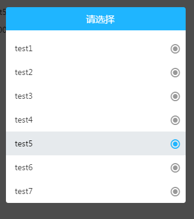

# select-box

#### 语言：angularjs

#### 功能： 
下拉框指令

#### 参数：
##### options             <类型：obj>    双向绑定的数据
           属性：list     <类型：array> (可以是对象数组，可以是普通数组)
           属性：index    <类型: int> 选中第几个元素，默认0
           属性：title    <类型：string>（头部提示，默认“请选择”）
           属性：attrNmae <类型: string>如果list是对象数组，则要传下拉框中要显示的属性名
           属性：value    <类型：obj或string>可通过传value来默认选择下拉框中与value相同的选项

#### 返回值：
      options.selectedValues  <类型：array> 长度为三对象数组[{},{},{}]


#### 用法：
##### html：
```html
    <select-box options='options2'></select-box>
```

##### js:
```javascript 
    $scope.options2 = {
      title: '请选择',
      list:[{name:'test1'},{name:'test2'},{name:'test3'},{name:'test4'},{name:'test5'},{name:'test6'},{name:'test7'}],
      attrName:'name'
    };
```

#### 效果图
